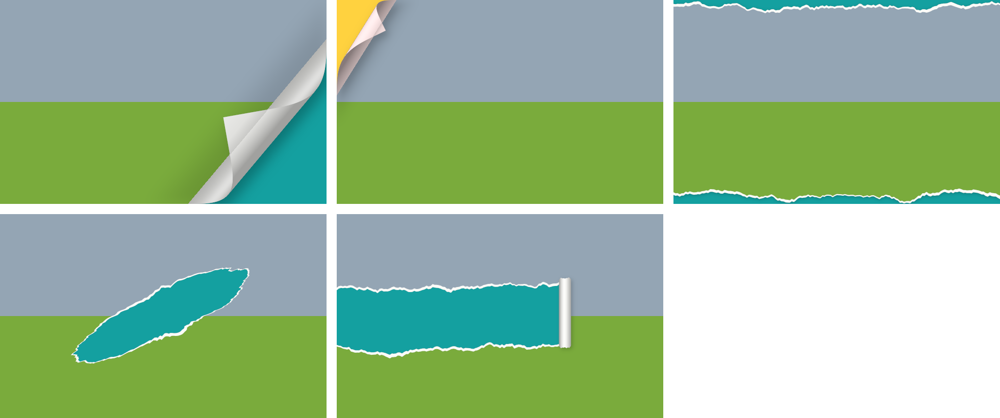

# Effets de page — plug-in pour GIMP 3

Plug-in GIMP 3 : effets de **coin de page qui tourne** et de **papier déchiré**.
Plug-in Python 3 (API GObject de GIMP 3), testé avec GIMP 3.2.2.

Après installation, les filtres se trouvent dans **Filtres › Effets de page** :

- **Coin de page…** : soulève et enroule un coin du calque actif ;
- **Papier déchiré…** : bords déchirés, trou arraché ou bande arrachée avec rouleau.



## Installation

1. Repérez le dossier des greffons : *Édition › Préférences › Dossiers › Greffons*. Par défaut :
   - Windows : `%APPDATA%\GIMP\3.0\plug-ins\` (ou `3.2`, selon votre version)
   - macOS : `~/Library/Application Support/GIMP/3.0/plug-ins/`
   - Linux : `~/.config/GIMP/3.0/plug-ins/`
2. Copiez-y **le dossier entier** `page-effects/` (il doit contenir `page-effects.py` et `pe_core.py`).
   Le nom du dossier doit rester identique au nom du fichier `.py`.
3. Linux / macOS : rendez le script exécutable :
   `chmod +x page-effects/page-effects.py`
4. Redémarrez GIMP.

## Utilisation

Les effets sont **non destructifs** : le calque reçoit un **masque de calque**, et le verso de la page,
la frange du papier et les ombres sont créés dans des **calques séparés**, que vous pouvez retoucher,
déplacer ou supprimer. Ce qui apparaît sous la page, c'est **le contenu des calques du dessous** :
placez une autre photo en dessous pour obtenir l'effet « page qui se tourne sur une autre photo ».

### Coin de page

| Paramètre | Rôle |
|---|---|
| Coin | Bas droit, bas gauche, haut droit, haut gauche |
| Soulèvement (%) | Déplacement du coin, en % de la diagonale (petit = coin corné, 60 %+ = page presque tournée) |
| Angle (°) | Écart par rapport à la diagonale (courbure plus horizontale ou plus verticale) |
| Rayon de courbure | 0 = automatique |
| Couleur du verso | Couleur du dos du papier |
| Ombre (%) | Opacité du calque d'ombre |
| Remplir le dessous | Ajoute un calque de couleur sous la page (sinon : transparence / calques inférieurs) |

Calques créés : *Coin de page — verso*, *Coin de page — ombre* (et *Dessous* si demandé).

### Papier déchiré

| Paramètre | Rôle |
|---|---|
| Type | Bords déchirés, trou arraché, bande arrachée (rouleau) |
| Profondeur des dents | Amplitude de la dentelure (px) |
| Frange blanche | Largeur de l'âme blanche du papier visible le long de la déchirure |
| Rugosité | Finesse des fibres |
| Graine | Changez-la pour obtenir une autre forme de déchirure |
| Bord haut / droit / bas / gauche | (Bords déchirés) côtés à déchirer |
| Trou : centre, largeur, hauteur, angle | (Trou) position et forme en % du calque |
| Bande : position, épaisseur, sens, avancement, rouleau | (Bande) le rouleau de papier est dessiné au bout de la déchirure |

Calques créés : *Papier déchiré — papier*, *Papier déchiré — ombre*, et pour la bande *Rouleau* / *Rouleau — ombre*.

## Script / traitement par lots

Les procédures sont disponibles dans le PDB (*Filtres › Console Python*) :

```python
pdb = Gimp.get_pdb()
proc = pdb.lookup_procedure('plug-in-pe-page-curl')     # ou 'plug-in-pe-paper-tear'
cfg = proc.create_config()
cfg.set_property('image', image)
cfg.set_core_object_array('drawables', [layer])
cfg.set_property('corner', 'tr')
cfg.set_property('amount', 25.0)
proc.run(cfg)
```

## Licence

MIT

## Remarques

- Sélectionnez **un seul calque de pixels** (pas un groupe) avant de lancer le filtre.
- Si le calque a déjà un masque, la découpe y est ajoutée.
- Le rendu du verso est calculé en Python : sur de très grandes images (> 20 Mpx) avec un fort
  soulèvement, comptez quelques secondes.
- GIMP intègre aussi un ancien filtre *Filtres › Déformations › Recourbement de page* ; celui-ci offre
  une courbure éclairée, les 4 coins, un angle libre et les effets de papier déchiré.
